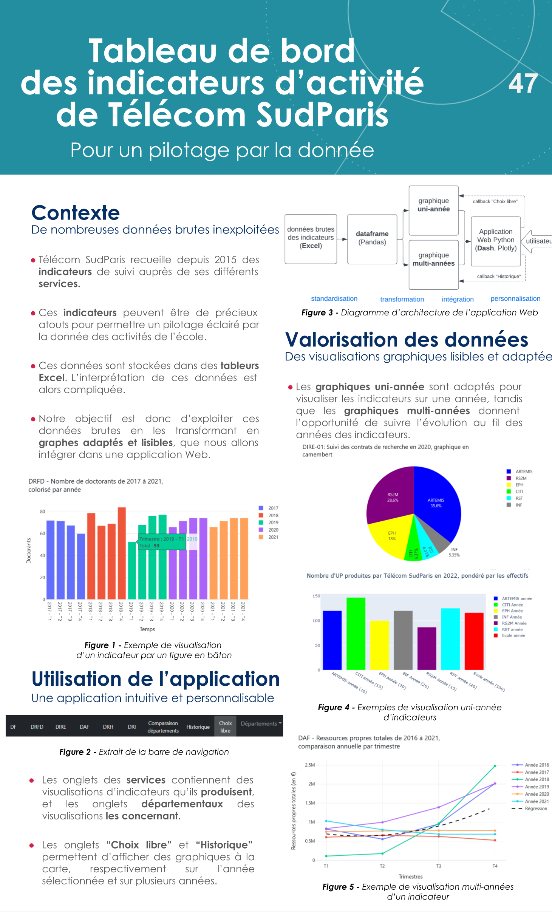

Télécom SudParis has been collecting monitoring indicators from its various departments and services since 2015. These indicators can be valuable assets for data-driven steering of the school's activities. These data are stored in Excel spreadsheets, which makes them difficult to interpret.

This student project was made during Spring 2023. The aim of this project is to exploit those raw data by transforming it into suitable, readable graphs, integrated into a web application.

The Web application is developed with the framework ``Dash``. The data is processed with ``Pandas``, and visualized within the application with ``Plotly``. 

Data collection is out of the scope of the project. Note that data are incomplete, hence the presence of some gaps for some periods.




## test the app

- Python version: ``3.9``
  
- go into de ```dashboard-tsp``` folder

- create a virtual Python environment:

```python -m venv .venv```

- activate it:

windows in git bash terminal: ```source .venv/Scripts/activate```

linux: ```source .venv/bin/activate```

- install packages:

```pip install -r requirements.txt```

- launch app:

```python ./src/app.py```


- the app is now accessible at:

```http://127.0.0.1:8050```


